# Cyber Defense Lab

**A browser-based blue team training simulator.** Practice SOC fundamentals through a
3,200-question quiz system, a timed incident-response dashboard with post-shift learning
reports, and a growing set of analyst tool prototypes — all running as static files,
entirely in the browser.

> ⚠️ **Work in progress.** This is a personal learning and portfolio project. Mechanics,
> visuals, and content are actively evolving. Some experimental modes are rough by design.

**Who this is for:** SOC / blue-team learners practising the fundamentals, aspiring junior
analysts who want hands-on reps, and portfolio reviewers / recruiters / hiring managers
looking at how I think about detection, triage, and incident work.

**Live demo:** https://lohetapja.github.io/CyberDefenseRunner/
*(The repository keeps its original `CyberDefenseRunner` name so existing links stay valid;
the public-facing name of the project is Cyber Defense Lab.)*

---

## Features

- **3,200 validated questions** across 8 cybersecurity topics, each bank independently
  checked for unique IDs, balanced answer positions, tier distribution, duplicate prompts,
  and certification-brand neutrality.
- **Multiple training modes** from calm quiz study to timed incident pressure.
- **Post-incident learning reports** — missed questions are replayed with explanations
  after the pressure is off, mirroring how real SOC teams run post-incident reviews.
- **Analyst tool prototypes** — small, practical utilities a junior analyst would
  actually use, built as standalone pages.
- **Zero infrastructure** — no backend, no accounts, no database, no build step.
  Plain HTML/CSS/JS served as static files.

## Modes

| Mode | Status | What it trains |
|---|---|---|
| **Quiz Training** | Stable | Core knowledge across 8 learning paths, with topic / tier / wave-count filters, scoring, and a results report. |
| **SOC Dashboard** | Stable | Timed incident response: defend three nodes, triage threats under a configurable response timer (10s–45s or untimed). |
| **After-Action Report** | Stable | Post-shift review inside SOC Dashboard: every missed question replayed with the correct answer, explanation, and topic to review. Copyable as Markdown. |
| **Analyst Companion** | Stable | Lightweight learning-progression layer in Quiz Training (see below). |

The main menu groups the rest into two sections: **Analyst Tools** (the seven tools below)
and **Experimental Game Modes**.

## Flagship workflow: Invoice 4471

The analyst tools are connected through one canonical, fictional scenario — **Invoice 4471**
(phishing → encoded PowerShell → blocked outbound connection) — so the same case reads
consistently end to end. The landing page's **Recommended Analyst Workflow** walks it in order:

**Triage → Timeline → Artifact Map → Report → Detection**

1. **SOAR-Lite Alert Triage** — verdict, severity, MITRE mapping, and analyst guidance.
2. **Incident Timeline Builder** — reconstruct the event sequence.
3. **Artifact Relationship View** — a read-only evidence map of how the users, hosts, files,
   processes, alerts, destinations, and response actions connect.
4. **SOC Alert Report Generator** — a structured NIST-lifecycle report.
5. **KQL Detection Assistant** — draft a detection so it's caught next time.

Each tool reads the shared scenario pack and falls back to its own built-in sample if it isn't
present. Everything runs **in the browser on safe simulated data** — no backend, no accounts,
and no real SIEM / EDR / cloud / threat-intelligence integration or live telemetry.

## Workflow preview

The connected Invoice 4471 workflow, end to end. All screenshots use fictional, simulated
training data only.

**Landing page — Recommended Analyst Workflow**

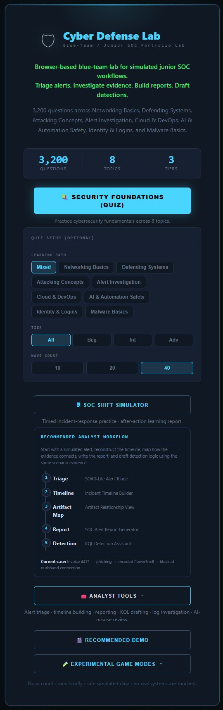

**SOAR-Lite Alert Triage**

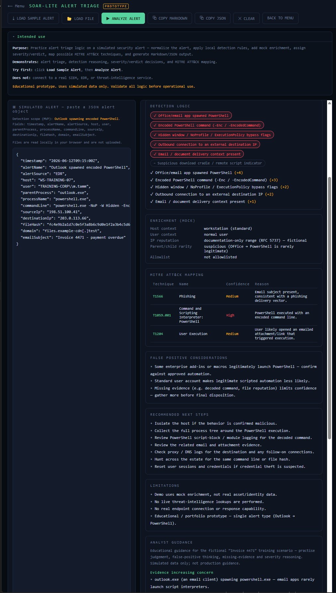

**Incident Timeline Builder**

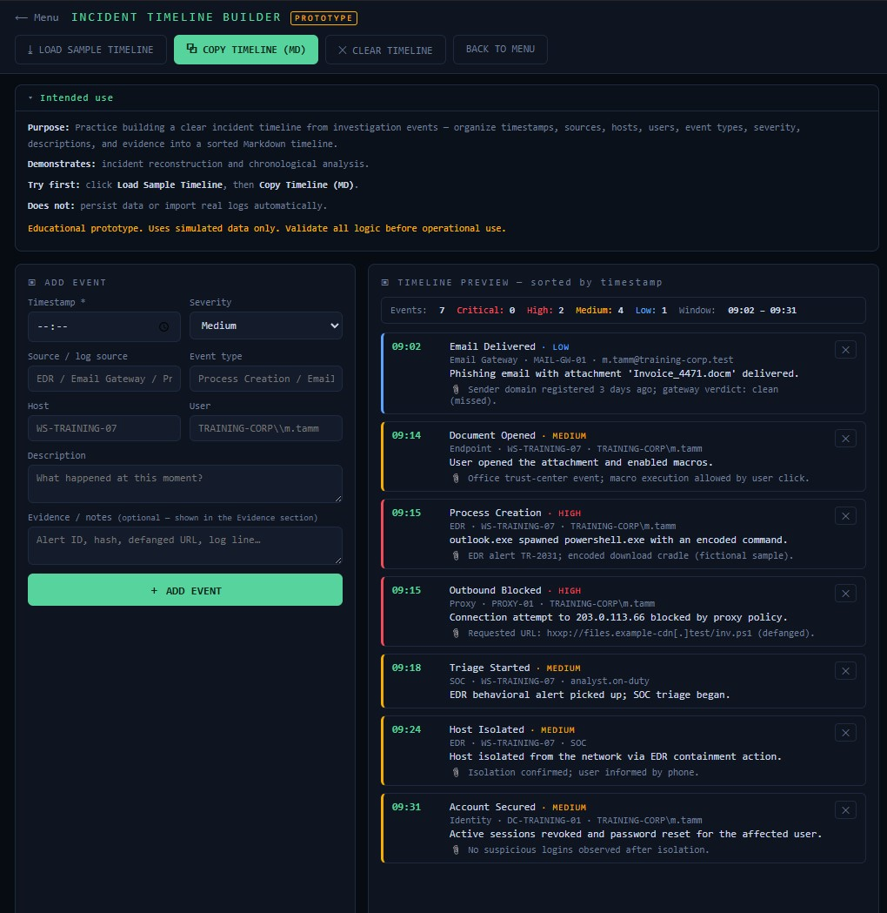

**Artifact Relationship View**

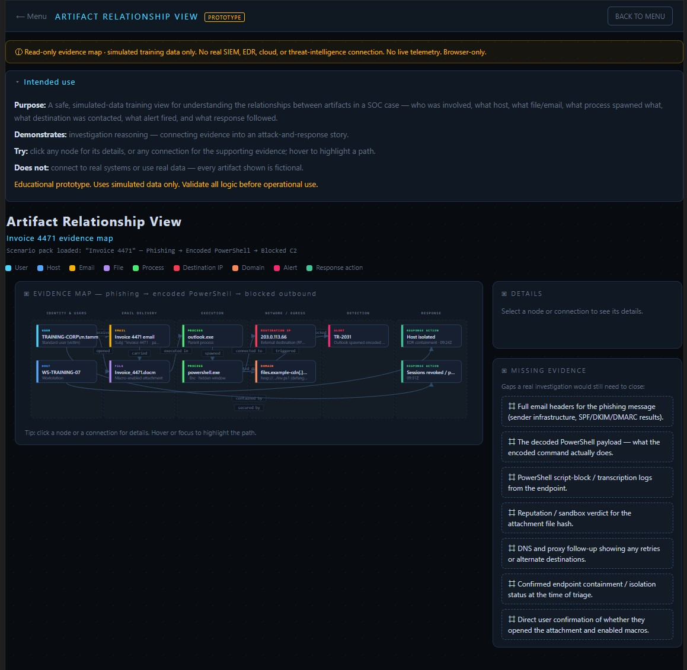

**SOC Alert Report Generator**

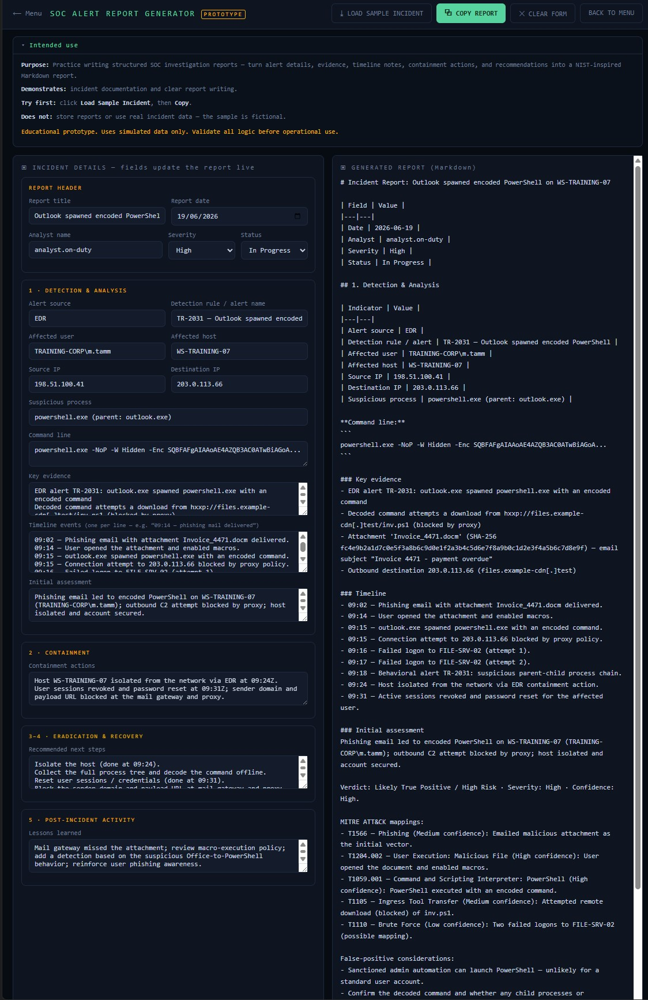

**KQL Detection Assistant**

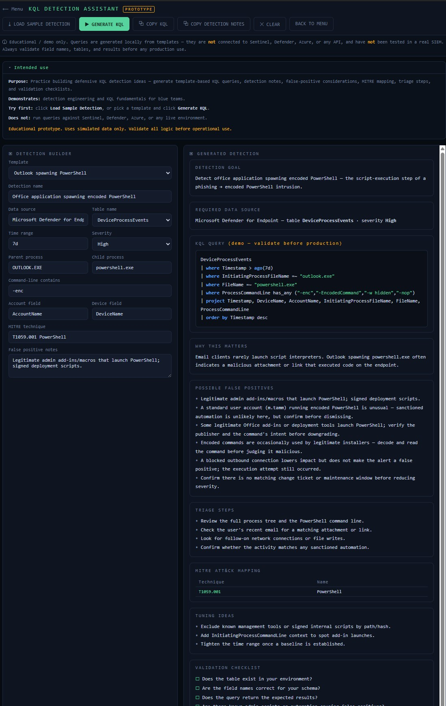

## Analyst Tools

Seven standalone, browser-only utilities a junior analyst would actually reach for. All are
working **prototypes** — local, client-side, and fed with safe simulated data only.

| Tool | Status | What it trains |
|---|---|---|
| **SOAR-Lite Alert Triage** | Prototype | Auto-triage a simulated alert: enrichment, severity reasoning, verdict, and MITRE ATT&CK mapping, with Markdown/JSON output. |
| **KQL Detection Assistant** | Prototype | Build and explain template-based KQL detection ideas with detection notes, false-positive considerations, and a validation checklist. *(Generates queries locally — not connected to a real SIEM.)* |
| **SOC Alert Report Generator** | Prototype | Structured incident reporting: a form that produces a clean Markdown report following the NIST incident-handling lifecycle, with a fictional sample incident loader. |
| **Incident Timeline Builder** | Prototype | Turn timestamped investigation events into a sorted, exportable Markdown timeline. |
| **Artifact Relationship View** | Prototype | A read-only evidence map for the Invoice 4471 case: shows how users, hosts, files, processes, alerts, destinations, and response actions connect, with click-through node and edge details. |
| **Log Parser / SIEM Demo** | Prototype | Paste pipe-delimited sample logs, filter and group them, highlight suspicious activity, and export investigation notes. |
| **AI Misuse Detection Demo** | Prototype | A defensive demo for spotting risky / shadow-AI usage and possible data exposure in simulated enterprise logs. |

## Experimental Game Modes

| Mode | Status | What it trains |
|---|---|---|
| **Defense Mission** | Experimental | Topology-based tower defense (preparation → attack phases). |
| **Network Defense Mission v2** | Experimental | Layer-matching tower defense: NGFW vs network threats, WAF vs application threats, EDR vs host threats — mismatched layers are bypassed and logged. |

## Analyst Companion

A small, optional progression layer in Quiz Training, styled as a cyber analyst assistant
(not a cartoon pet). It tracks **energy**, **credits**, and **badges** earned from answering,
lets you set a **companion name** and pick a **companion type**, and persists everything in
the browser via **localStorage** — no account or backend. It's a light UX/engagement layer
and does not affect scoring or question difficulty.

## Learning paths

Networking Basics · Defending Systems · Attacking Concepts · Alert Investigation ·
Cloud & DevOps · AI & Automation Safety · Identity & Logins · Malware Basics
(8 topics × 400 questions; tiers: 200 Beginner / 140 Intermediate / 60 Advanced each)

## Tech stack

- **HTML5 / CSS3 / vanilla JavaScript** — no frameworks, no build tooling
- **GitHub Pages** for hosting (pure static site)
- A reusable **question validator** (`tools/`) that runs in the browser or Node

## Skills demonstrated

A rough map of which part of the project exercises which SOC / blue-team skill:

| Project part | Skill it reflects |
|---|---|
| **Quiz Training** | Cybersecurity fundamentals across 8 topics |
| **SOC Dashboard** | Timed triage and incident-response decision-making under pressure |
| **SOAR-Lite Alert Triage** | Alert triage, enrichment, and severity/verdict reasoning |
| **KQL Detection Assistant** | Detection logic and KQL practice |
| **SOC Alert Report Generator** | Structured incident reporting (NIST lifecycle) |
| **Incident Timeline Builder** | Event sequencing and timeline reconstruction |
| **Artifact Relationship View** | Connecting evidence into an attack-and-response story |
| **Log Parser / SIEM Demo** | Log analysis and filtering |
| **AI Misuse Detection Demo** | Shadow-AI / data-exposure awareness |
| **Analyst Companion** | Learning-progression design and front-end UX |

These are practice and demonstration exercises, not production tooling.

## What I learned

- Designing deterministic game rules so learning content stays verifiable and fair
- Writing and *validating* large question banks (balance, duplicates, distractor quality)
- Structuring incident reports around the NIST incident-handling lifecycle
- Why timed pressure and post-incident review need to be separate learning moments
- Keeping a multi-mode project maintainable with standalone pages and shared data files

## Current status

- Quiz Training, SOC Dashboard, the After-Action Report, and the Analyst Companion are stable.
- All seven Analyst Tools are working prototypes (local, simulated data only — not production tools).
- The **Invoice 4471** workflow (Triage → Timeline → Artifact Map → Report → Detection) is connected and demo-ready.
- Defense Mission modes are playable experiments, not yet balanced.

See [`ROADMAP.md`](ROADMAP.md) for what's next and [`TESTING.md`](TESTING.md) for the
pre-commit manual test checklist.

## Screenshots

**Main menu — Analyst Tools section**

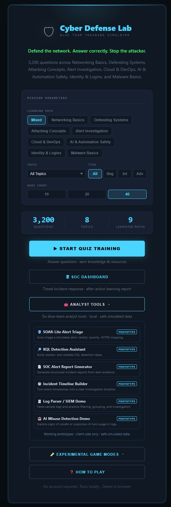

**Main Quiz Training with the Analyst Companion**

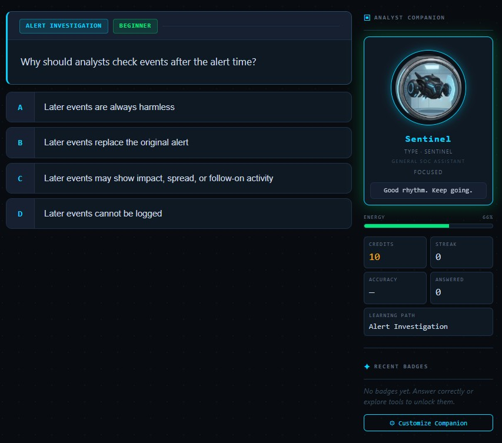

**SOC Dashboard — timed incident response**

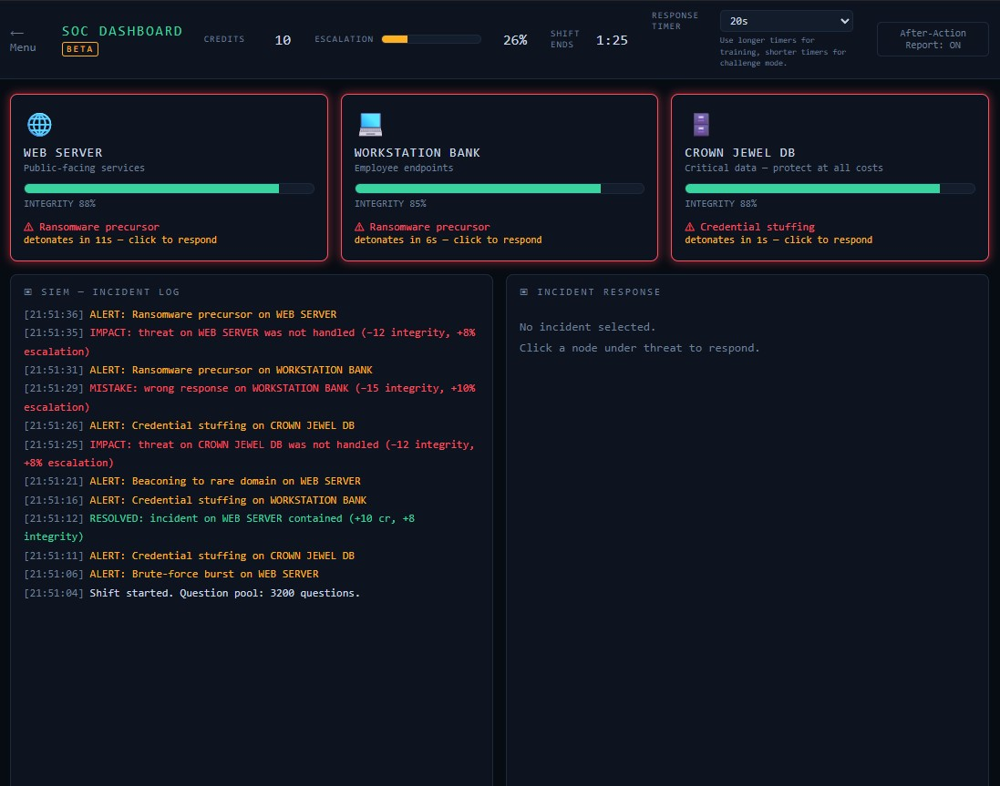

**After-Action Report — post-shift learning review**

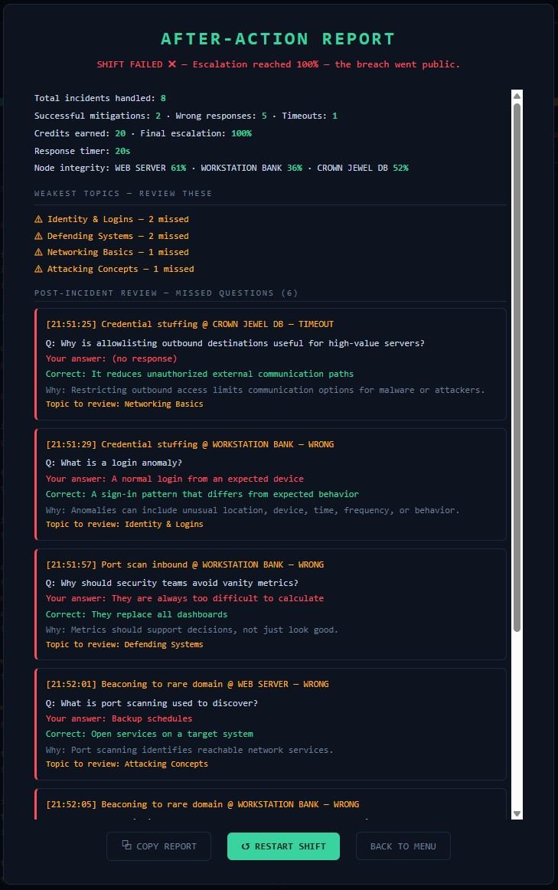

**SOAR-Lite Alert Triage — verdict, severity & MITRE mapping**

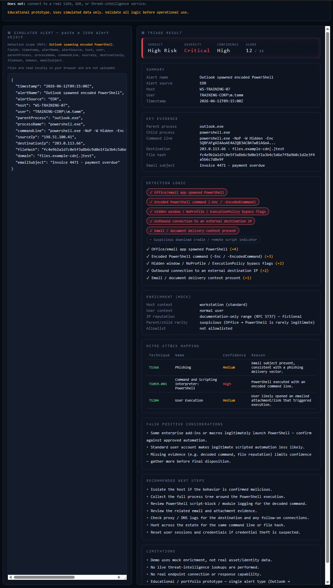

**KQL Detection Assistant — generated query & detection notes**

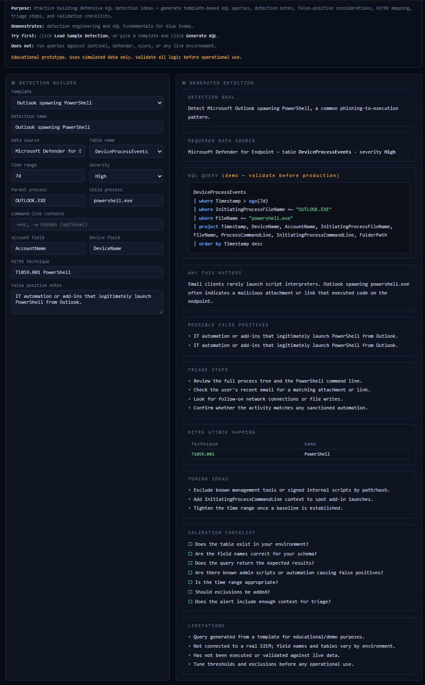

**SOC Alert Report Generator — structured Markdown report**

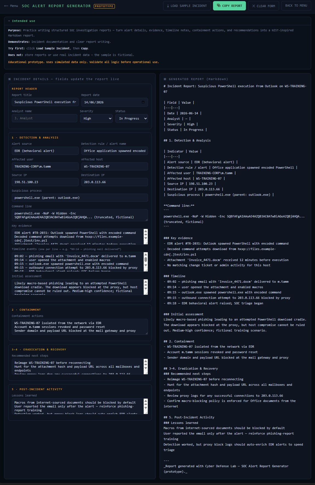

*All screenshots use fictional, simulated training data only.*

## How to run locally

A local web server is recommended (browsers restrict some behavior on `file://`).

**Windows:** double-click `start.bat` (starts a server on port 3900 and opens the site).

**Any OS with Python:**

```
python -m http.server 3900
```

Then open **http://localhost:3900**.

## Project docs

For reviewers or future development work, the supporting documentation is here:

- [Architecture overview](docs/architecture.md) — static/browser-only structure, modules, data boundaries, and limitations.
- [Portfolio demo flow](docs/demo-flow.md) — recommended 3–5 minute walkthrough for showing the project.
- [Testing checklist](TESTING.md) — manual checks for the quiz, SOC Dashboard, analyst tools, and navigation.
- [Roadmap](ROADMAP.md) — planned improvements and future direction.
- [Claude working rules](CLAUDE.md) — guardrails used for AI-assisted development on this repo.

## Disclaimer

This is an **educational training project**. All incidents, alerts, hostnames, users,
and indicators used in samples and game content are **fictional**, using
documentation-reserved IP ranges and invented organizations. Nothing here is derived
from real company data, and the content teaches defensive recognition — not operational
attack technique.

## License

MIT — see [`LICENSE`](LICENSE).
